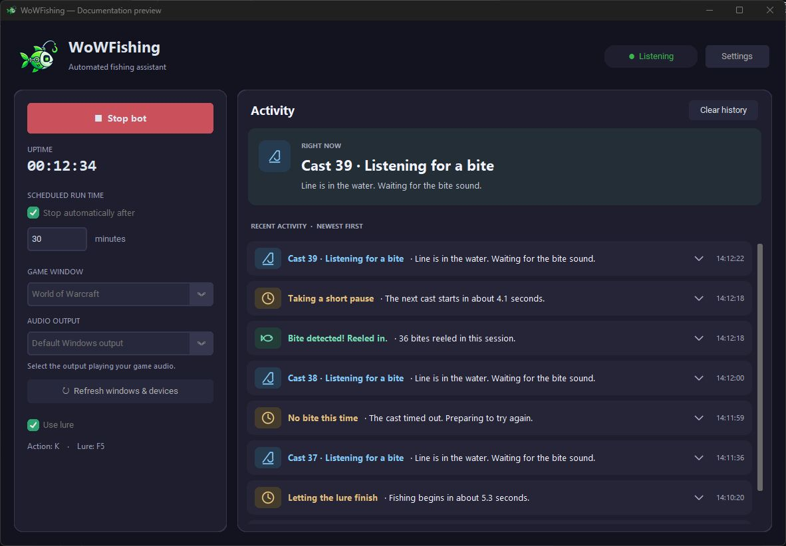
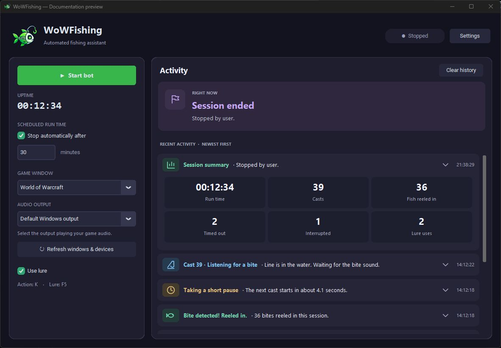

# WoWFishing

A Windows fishing assistant for World of Warcraft. It casts your line, listens
for the bite sound, and reels in automatically. You can also apply lures and
set a time limit for your session.

*The real application with sample activity for illustration.*

## Getting started

1. **Open the app.** Extract the entire `WoWFishing-Windows.zip` release, then
   launch `WoWFishing.exe`. Keep the `_internal` folder beside it. No Python
   installation is needed.
2. **Prepare WoW.** Stand at a fishing spot and set up one in-game key that
   both casts and reels in, such as the Better Fishing action binding.
   Make sure the game sound is audible.
3. **Choose your window and audio.** Select your WoW window and the audio output
   playing the game. Use **Refresh windows & devices** if either is missing.
4. **Set your key.** Open **Settings**, enter the same **Action key** you bound
   in WoW, and click **Save settings**. The app does not create game bindings.
5. **Start fishing.** Click **Start bot** and watch the first few casts.
   Click **Stop bot** or close the app to end the session.

The app brings WoW to the foreground before each key press. Change settings
before starting a run; they are locked while the bot is running.

## Your options

In the main window:

| Option | What it does |
| --- | --- |
| **Game window** | Chooses which WoW window receives key presses. |
| **Audio output** | Chooses where to listen for bite sounds. |
| **Stop automatically after** | Ends the session after the number of minutes you enter. |
| **Use lure** | Applies your lure at the start and reapplies it at the configured interval. Set up a lure macro in WoW first. |
| **Clear history** | Clears activity cards while keeping the current status visible. |

Open **Settings** for:

| Setting | What it does |
| --- | --- |
| **Action key** / **Lure key** | Match your in-game fishing action and lure macro. Defaults: `K` / `F5`. |
| **After a bite** / **After timeout** | Minimum and maximum pause before the next cast. |
| **Lure cast wait** / **Lure interval** | How long to wait for a lure to finish, and how often to reapply it. |
| **Cast timeout** | How long to listen before trying another cast. Default: 23 seconds. |
| **Detection threshold** | How strong a sound match must be. Start with the default of `0.40`; a higher value requires a stronger match. |

Your choices are saved for the next launch. Packaged releases store settings in
`%APPDATA%\WoWFishing\settings.yaml`, so they survive replacing the app folder.

## Activity and session summary

**Activity** shows the current step at the top, with the newest log entries
first below it. Expand an entry using the arrow beside its timestamp to see
the full message and details.

When a session ends, its summary shows the stop reason, run time, casts, fish
reeled in, timeouts, interrupted casts, and lure uses.

*Example summary using sample data. “Fish reeled in” counts detected bites
followed by a reel-in key press, not confirmed catches.*

## If something is not working

- **No bites detected?** Check that the selected audio output plays the game
  and that the bite sound is audible. Detection is experimental; observe a few
  casts before adjusting the threshold.
- **Reeling in at the wrong time?** Other apps on the selected audio output
  are heard too. Reduce competing audio and try a higher detection threshold.
- **A cast fails?** The app retries after the cast timeout. It does not detect
  out-of-range sounds.
- **The bot stops unexpectedly?** Read the error in Activity. A closed game
  window, a focus failure, or an audio error stops the session. Moving the mouse
  to a screen corner also triggers the fail-safe at the next key press.

## Running from source

See the [development guide](docs/development.md) for setup, building a Windows
release, and tests. Detector tuning and command-line tools are covered in the
[audio detector guide](docs/audio-detector.md).
